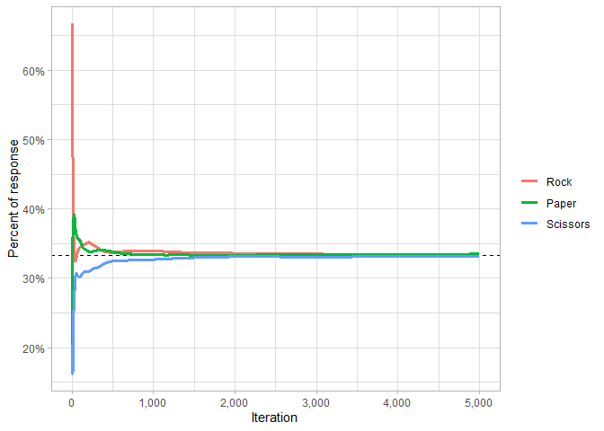

### Rock, Paper, Scissors AI trained through self-play via Counterfactual Regret Minimization Algorithm

The following implements the Counterfactual regret minimization
algorithm for rock, paper, scissors. Through this algorithm the model
learns the Nash equilibrium for the game through the following steps:

-   Pick an action (rock, paper, or scissors)
-   Pick an another action to serve as an opponent action
-   Calculate the regret of playing the action given the opponent’s
    action (e.g., playing rock when an opponent plays paper leads to
    regret)
-   Compute the positive regrets (negative regrets are for actions the
    model is happy to not have played – these are ignored)
-   Add the positive regrets to the running count of positive regrets
-   Normalize the sum of positive regrets (this produces a probability
    distribution in which to sample actions)
-   Add the normalized positive regrets (probability distribution) to a
    cumulative probability distribution
-   Once normalized, this distribution is the model’s final
    probabilities in which to optimally sample actions

<br />

``` r
library(tidyverse)
library(R6)

theme_set(theme_light())

cfr_rps <- R6Class(
    classname = "cfr_rps",
    public = list(
        n_iter = NULL,
        iter = NULL,
        actions = NULL,
        n_actions = NULL,
        strategy = NULL,
        strategy_sum = NULL,
        regret = NULL,
        regret_sum = NULL,
        strategy_sum_matrix = NULL,
        initialize = function(n_iter = 10000){
            self$n_iter = n_iter
            self$iter = 1
            
            self$actions = c("rock", "paper", "scissors")
            self$n_actions = length(self$actions)
            
            self$strategy = rep(1 / self$n_actions, self$n_actions)
            self$strategy_sum = vector("numeric", self$n_actions)
            self$regret = vector("numeric", self$n_actions)
            self$regret_sum = vector("numeric", self$n_actions)
            
            self$strategy_sum_matrix = matrix(NA_integer_, nrow = n_iter, ncol = self$n_actions)
            colnames(self$strategy_sum_matrix) = self$actions
        },
        update_iter = function(){
            self$iter = self$iter + 1
        },
        utility = function(action, opp_action){
            if(action == opp_action) return(0)
            if(action == "rock" & opp_action == "paper") return(-1)
            if(action == "rock" & opp_action == "scissors") return(1)
            if(action == "scissors" & opp_action == "rock") return(-1)
            if(action == "scissors" & opp_action == "paper") return(1)
            if(action == "paper" & opp_action == "scissors") return(-1)
            if(action == "paper" & opp_action == "rock") return(1)
        },
        get_action = function(){
            sample(self$actions, size = 1, prob = self$strategy)
        },
        compute_regret = function(action, opp_action){
            self$regret = map_dbl(self$actions, ~ self$utility(action, opp_action) - self$utility(action, .x))
        },
        update_regret_sum = function(){
            pos_regret = ifelse(self$regret > 0, self$regret, 0)
            if(sum(pos_regret) > 0) {
                self$regret_sum = self$regret_sum + (pos_regret / sum(pos_regret))
            } else {
                self$regret_sum = rep(1 / self$n_actions, self$n_actions)
            }
        },
        compute_strategy = function(){
            pos_regret = ifelse(self$regret_sum > 0, self$regret_sum, 0)
            if(sum(pos_regret) > 0) {
                self$strategy = self$strategy + (pos_regret / sum(pos_regret))
            } else {
                self$strategy = rep(1 / self$n_actions, self$n_actions)
            }
        },
        update_strategy_sum = function(){
            self$strategy_sum = self$strategy_sum + self$strategy
            self$strategy_sum_matrix[self$iter, ] = self$strategy_sum
        },
        normalize_strategy_sum = function(){
            self$strategy_sum_matrix = self$strategy_sum_matrix %>% 
                as_tibble() %>%
                mutate(total = rock + paper + scissors) %>%
                mutate(across(-total, ~ .x / total))
        },
        train = function(){
            for(i in seq_len(self$n_iter)){
                action = self$get_action()
                opp_action = self$get_action()

                self$compute_regret(action, opp_action)
                self$update_regret_sum()
                self$compute_strategy()
                self$update_strategy_sum()
                self$update_iter()
            }
            
            self$normalize_strategy_sum()
        },
        plot = function(){
            self$strategy_sum_matrix %>% 
                mutate(iter = row_number()) %>%
                select(-total) %>%
                pivot_longer(-iter, names_to = "action", values_to = "prop") %>%
                mutate(action = str_to_title(action)) %>%
                mutate(action = fct_inorder(action)) %>%
                ggplot(aes(iter, prop, color = action)) +
                geom_hline(yintercept = 1/3, linetype = "dashed") +
                geom_line(size = 1.25) +
                labs(x = "Iteration",
                     y = "Percent of response",
                     color = NULL) +
                scale_x_continuous(labels = scales::comma_format()) +
                scale_y_continuous(labels = scales::percent_format(accuracy = 1))
        }
    )
)

n_iter <- 5000

cfr_trainer <- cfr_rps$new(n_iter = n_iter)

cfr_trainer$train()
```

<br />

After training the model through self play for 5,000 iterations, the
model learns to play rock, paper, and scissors in equal proportions.
This algorithm can be extended to other games such as poker.

``` r
cfr_trainer$plot()
```



<br /> <br /> <br /> <br /> <br />
